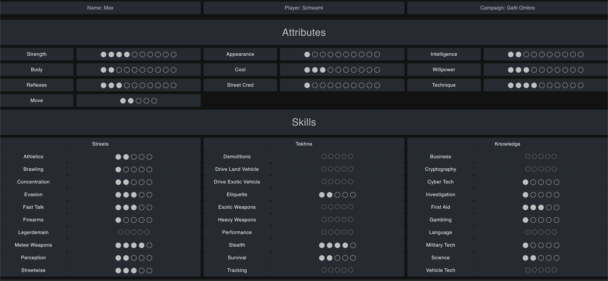
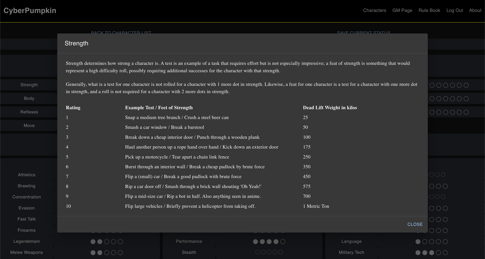
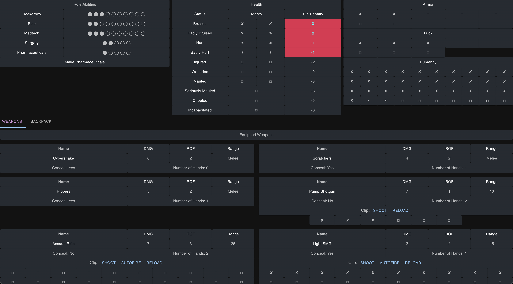
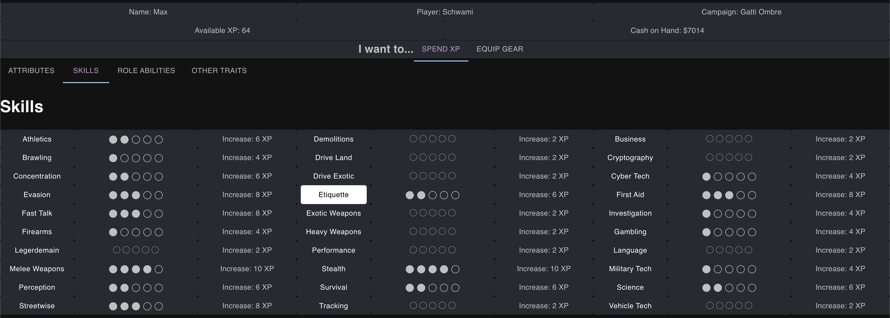
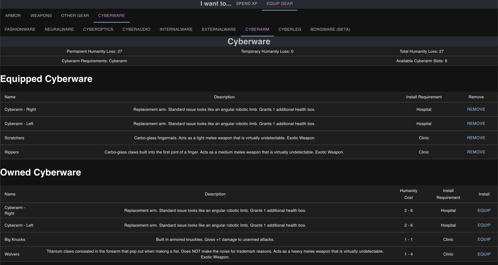
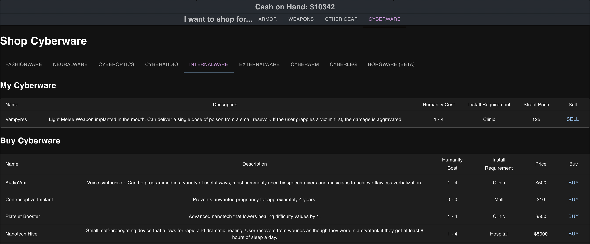
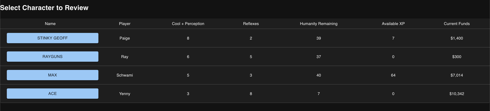
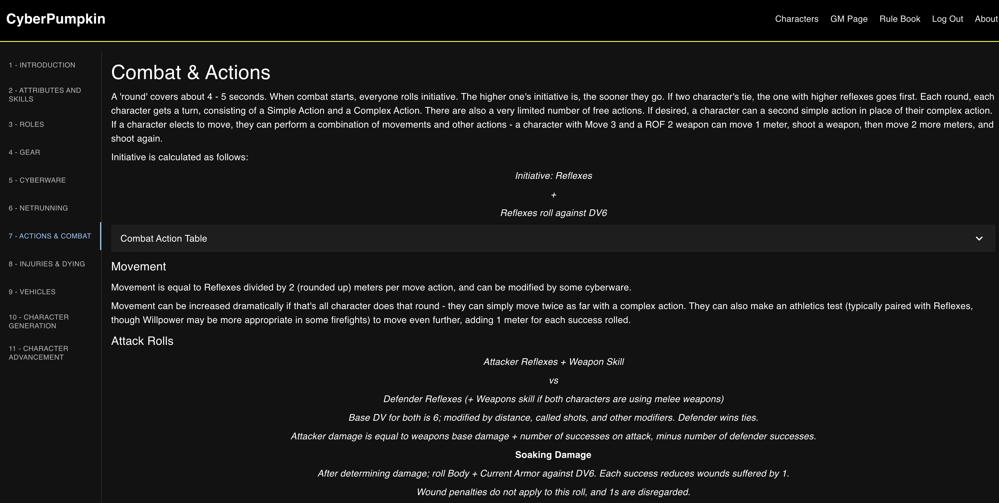

# Cyberpumpkin

## Description
This project is aimed at players of a variation of the Cyberpunk TTRPG using the D10 system. It is designed to assist players and GMs with creating, tracking, and modifying characters.

- [Flowchart](https://www.figma.com/file/IG0fbEmuLQvmyv1WP1Vbyy/Untitled?type=whiteboard&node-id=1%3A297&t=GvfsTTlVVhah3tAG-1)
- [DB Planner](https://dbdesigner.page.link/D7aPbnUrHFgm7T9m6)

## Screen Shots
### In Play Sheets

### Dialogs for most traits and items

### Saved trackers for health, armor, ammo, and more!


### Character Management - Spend XP

### Managed equipping, tracking slots, etc.


### Shopping


### GM - Character Details at a glance, character advancement on click through


### Rules Reference


### Amazing Jokes


# Development Notes

## Prerequisites
The development environment used:

- [Node.js](https://nodejs.org/en/)
- [PostrgeSQL](https://www.postgresql.org/)
- [Nodemon](https://nodemon.io/)
- [VS Code](https://code.visualstudio.com/)
- [Postman](https://www.postman.com/)

## Create database and user table

Create a new database called `cyberpunk` and create a `user` table:

```SQL
CREATE TABLE "user" (
    "id" SERIAL PRIMARY KEY,
    "username" VARCHAR (80) UNIQUE NOT NULL,
    "password" VARCHAR (1000) NOT NULL,
    "user_type" INT NOT NULL
);
```

User Types:
1: Standard User
2: Admin / GM User

You can then run the code in the database.sql file.

## Development Setup Instructions

- Run `npm install`
- Create a `.env` file at the root of the project and paste this line into the file:
  ```
  SERVER_SESSION_SECRET=yourSecretVariable
  ```
- You will get an error if the secret is less than 8 characters.
- Run `npm run server`
- Run `npm run client`
- Navigate to `localhost:3000`

## Usage
Click the Characters link and create a new character. Go through the steps, and save a new character. They can then be accessed through the character management link.

Characters, once made, can be accessed as in-play character sheets, XP and Equipment management, and a shopping tab.

In Play - 
Their weapons have automatic creation of clips. Armor and other stat modifications are also handled automatically based on the character's equipped items.
Miscellaneous gear can be accessed through the backpack, and consumed if relevant. They can also manage their money directly and add or reduce cash as appropriate during the game.

If they have the pharmaceuticals skill, they can access a submenu to craft pharmaceuticals. Likewise, if they have the netrunner skill they can access their deck and manage Netrunning actions.

Most skills, attributes, and other items can be clicked through to dialogs that hold information relevant to the clicked subject.
Most tables are sortable by header. 

Spend XP & Equip Gear
Characters can spend experience points to increase attributes, skills, and roles, as well as Luck, or remove temporary humanity losses.

Characters can equip and unequip armor, weapons, and the like, as well as cyberware.
Conflicts (equipping 2 armors, 2 right cyberarms, etc) are handled automatically, as are permanent and temporary humanity losses from installing and removing cyberware.

Shopping is pretty simple; it allows characters to sell unequipped items. Most of the tables are sortable.

GM Page - 
GMs can see a few character traits at a glance on the player list.
In the details for each character, the GM can add/remove humanity, money, experience, street cred, and luck.
Permanent changes are blocked behind toggles to prevent errant clicking.
GMs can also permanently delete a character.

Rulebook - 
This section contains information, tables, and the like necessary to play Cyberpumpkins.

## Built With
<a href="https://www.w3schools.com/w3css/defaulT.asp"></a>
<a href="https://www.w3schools.com/html/"></a>
<a href="https://www.w3schools.com/js/default.asp"></a>
<a href="https://www.postgresql.org/"></a>
<a href="https://reactjs.org/"></a>
<a href="https://redux.js.org/"></a>
<a href="https://www.figma.com/"></a>
<a href="https://material-ui.com/"></a>
<a href="https://nodejs.org/en/"></a>

## License
Copyright (c) 2023 David Schilmoeller

Permission is hereby denied to any person obtaining a copy of this software and associated documentation files (the "Software"), to deal in the Software without restriction, including without limitation the rights to use, copy, modify, merge, publish, distribute, sublicense, and/or sell copies of the Software, and to permit persons to whom the Software is furnished to do so. This license is not subject to any conditions.

THE SOFTWARE IS PROVIDED "AS IS", WITHOUT WARRANTY OF ANY KIND, EXPRESS OR IMPLIED, INCLUDING BUT NOT LIMITED TO THE WARRANTIES OF
MERCHANTABILITY, FITNESS FOR A PARTICULAR PURPOSE AND NONINFRINGEMENT. IN NO EVENT SHALL THE AUTHORS OR COPYRIGHT HOLDERS BE LIABLE FOR ANY CLAIM, DAMAGES OR OTHER LIABILITY, WHETHER IN AN ACTION OF CONTRACT, TORT OR OTHERWISE, ARISING FROM, OUT OF OR IN CONNECTION WITH THE SOFTWARE OR THE USE OR OTHER DEALINGS IN THE SOFTWARE.

## Acknowledgements
Special thanks to Plurbo for copious tolerance, support, and the occasional inspired comment and suggestion.

## Support
Instructions on submitting a support request can be found in the app, but basically ask Schwami.